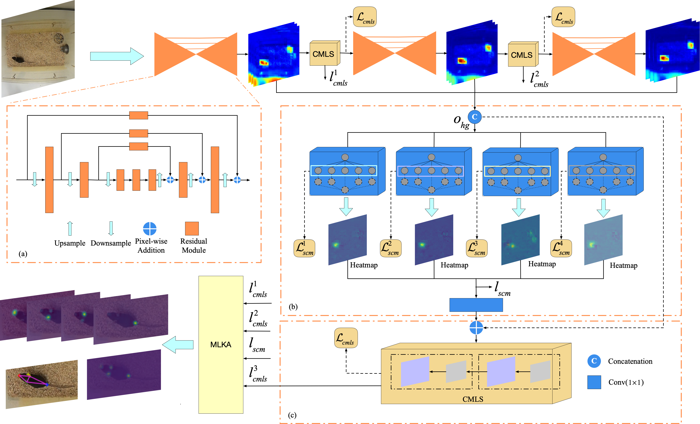

# Structured Context Enhancement Network for Mouse Pose Estimation

This repository provides a PyTorch implementation of the paper [ Structured Context Enhancement Network for Mouse Pose Estimation](https://ieeexplore.ieee.org/abstract/document/9492104). 

<p align="center">

</p>

## Requirements
Tested with:
* PyTorch 1.4.0

* Torchvision 0.5.0

* Python 3.6.8


## Training

* Before running `train.py`, we need to compile Directionmax operation used in our paper, which is inspired by the corner pooling scheme in [CornerNet](https://github.com/princeton-vl/CornerNet).
```

1)	Open google colab notebook 
2)	Select the runtime as GPU
3)	!git clone https://github.com/FeixiangZhou/GM-SCENet.git  <change name to your repo>
4)	cd Mouse_Tracking/cornernet/models/py_utils/_cpools
5)	!python setup.py install --user
6)	cd ../../../../

```
* Then train the model
```
`python train.py`
```


## Citation
If you find this repository useful, please cite our paper:
```
@article{zhou2021structured,
  title={Structured Context Enhancement Network for Mouse Pose Estimation},
  author={Zhou, Feixiang and Jiang, Zheheng and Liu, Zhihua and Chen, Fang and Chen, Long and Tong, Lei and Yang, Zhile and Wang, Haikuan and Fei, Minrui and Li, Ling and others},
  journal={IEEE Transactions on Circuits and Systems for Video Technology},
  year={2021},
  publisher={IEEE}
}
```

## Contact
For any questions, feel free to contact: `fz64@leicester.ac.uk`
